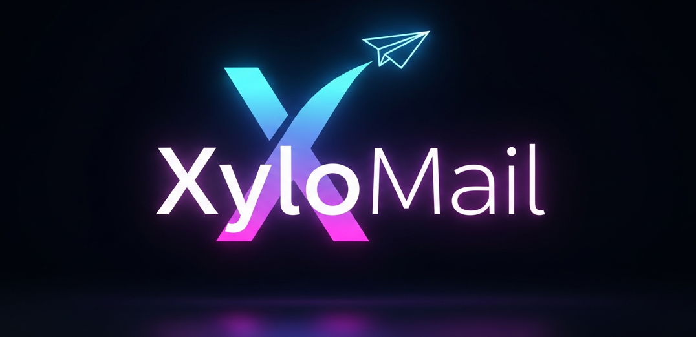

# XyloMail - Secure & Anonymous File Transfer

<p align="center">
  
</p>

<p align="center">
  Simple email-based file transfer service - perfect for public computers.
</p>

## What it does

XyloMail lets you:

-   Upload files (up to 4.5MB)
-   Send them to any email address
-   No sign-in required
-   Files delivered as ZIP archives

## Why use it?

Perfect for when you need to send files from a public/shared computer without logging into your personal email account.

## Tech Stack

-   **Framework**: [Next.js](https://nextjs.org/) (Pages Router)
-   **Language**: [TypeScript](https://www.typescriptlang.org/)
-   **Styling**: [Tailwind CSS](https://tailwindcss.com/)
-   **UI/Animations**: [Framer Motion](https://www.framer.com/motion/), [OGL](https://oframe.github.io/ogl/), and custom GLSL shaders.
-   **Email Delivery**: [Brevo (Sendinblue)](https://www.brevo.com/) & [Nodemailer](https://nodemailer.com/)
-   **File Handling**: [Formidable](https://www.npmjs.com/package/formidable) (for parsing) & [Archiver](https://www.archiverjs.com/) (for zipping)
-   **Deployment**: [Vercel](https://vercel.com/)

## Getting Started

Follow these steps to get a local copy of XyloMail up and running.

### Prerequisites

-   Node.js v18.x or later
-   `npm`, `yarn`, or `pnpm` package manager

### Installation & Setup

1.  **Clone the repository:**
    ```bash
    git clone https://github.com/your-username/xylo-mail-next.git
    cd xylo-mail-next
    ```

2.  **Install dependencies:**
    ```bash
    npm install
    ```

3.  **Set up environment variables:**
    Create a file named `.env` in the root of your project and add the following variables. You can get these credentials from your email service providers (Brevo, SMTP2GO, etc.).

    ```env
    # Brevo (Sendinblue) Configuration
    BREVO_API_KEY=your_brevo_api_key
    BREVO_SENDER_EMAIL=your_sender_email@example.com
    BREVO_SENDER_NAME=XyloMail

    # SMTP Fallback Configuration
    SMTP_HOST=your_smtp_host
    SMTP_PORT=587
    SMTP_USER=your_smtp_username
    SMTP_PASS=your_smtp_password
    SMTP_FROM_EMAIL=your_from_email@example.com
    SMTP_FROM_NAME=XyloMail
    ```

4.  **Run the development server:**
    ```bash
    npm run dev
    ```

5.  Open [http://localhost:3000](http://localhost:3000) in your browser to see the application.

## Running with Docker

Alternatively, you can run the project in a Docker container for a consistent development environment.

1.  **Prerequisites**:
    -   [Docker](https://www.docker.com/products/docker-desktop/) must be installed and running.

2.  **Build and run the container:**
    This command will build the Docker image and start the container in the background. It will automatically use the variables from your `.env` file.
    ```bash
    docker-compose up --build -d
    ```

3.  **Access the application:**
    Open [http://localhost:3000](http://localhost:3000) in your browser.

4.  **To stop the container:**
    ```bash
    docker-compose down
    ```

---